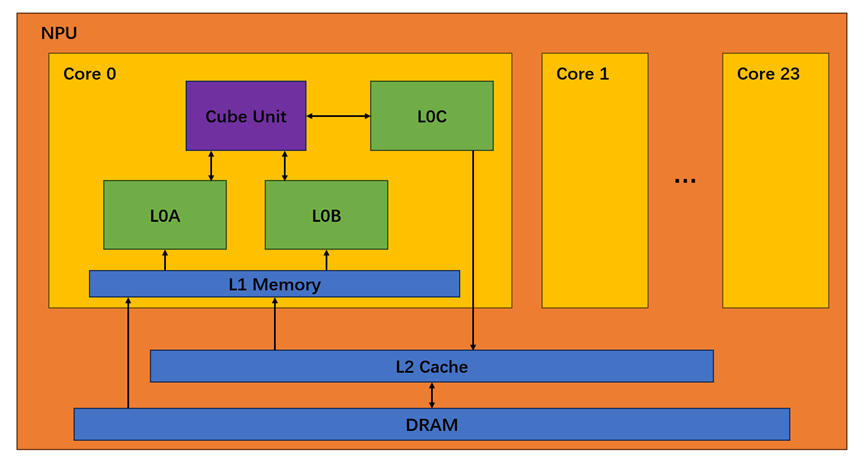
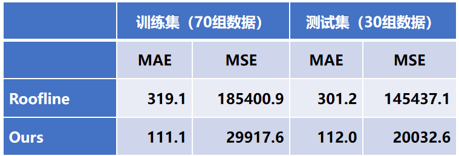
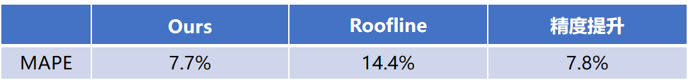

###项目简介###
1. 摘要：这是一种基于微观典型矩阵计算模式的矩阵计算仿真算法。

2. 背景：大规模矩阵乘法是高性能计算与人工智能领域的核心计算内核，其效率直接决定大模型训练等应用的性能上限。专用 AI 加速器理论峰值算力虽高，但受“内存墙”影响，实测效率与理论值差距显著，传统静态优化策略难以适配复杂场景。通过构建硬件性能仿真模型，可在软件层面优化矩阵运算的计算与数据调度策略，充分释放昇腾等处理器的硬件潜能。

3. 方法： 基于NPU多层硬件结构模型分批次建模算法模块：NPU多层硬件结构模块、矩阵分块策略、分批次调度机制、双缓冲数据传输优化、各层级带宽效率模型、计算与传输的延迟计算、FixPipe层的简化处理。
随着深度学习模型对算力需求的指数级增长，NPU（神经网络处理器）作为专用加速硬件，其架构设计与运算效率的匹配性成为性能优化的核心。基于 NPU 多层硬件结构的分批次建模算法，通过精准建模硬件层级交互、矩阵分块策略与批次调度逻辑，可量化不同场景下的计算延迟与带宽利用率，为算子优化与硬件资源配置提供可靠的依据。该算法尤其关注矩阵运算中数据在多级存储与计算核心间的流动特性，通过分批次并行调度实现计算与传输的高效重叠，从而贴近真实硬件的执行行为。

3.1 多层硬件结构建模 NPU 的硬件架构以 计算核心 + 多级存储 为核心约束： 计算核心层：由 24 个达芬奇核心组成，每个核心包含 Cube 计算阵列，主要执行矩阵乘加操作。通过与真实 aic_mac_time 对比，计算效率拟合为 0.97，推测来自 L0 分块和调度带来的固定开销。 片上缓存层：包含 L0 与 L1 两级缓存 L0 分为 L0A/L0B/L0C，容量分别为 64KB/64KB/256KB，用于向计算核心提供输入 A/B 和暂存输出 C。 L1 为 1MB，承担 L0 与外部存储之间的数据缓冲，是分块策略的主要约束来源。 L2 层：在仿真中不展开结构，仅作为“带宽效率影响项”存在，通过预设的效率字典动态修正 DRAM→L1 的有效带宽。 外部存储（DRAM）：容量 64GB，基础带宽固定，但实际带宽由效率因子动态修正。

3.2 矩阵分块策略（Tiling） 为满足各级缓存容量限制并提升复用，矩阵运算采用分层分块策略： L1 分块维度在 32～512 的 2 次幂范围内选择，优先选取可整除原矩阵维度的 tile，以减少边界填充开销 分块后的数据量需满足 L1 的双重约束： 子块总数据不超过 L1 的 50% L1 占用率不低于 60%（避免缓存浪费） L0 分块进一步对齐计算核心粒度（以 16×16 为基础 tile），通过组合拼接适配 L1 tile。 循环顺序支持多种遍历方式（如 mnk、kmn 等），不同顺序影响输入复用与传输压力，仿真会对其统一搜索。

3.3 分批次调度机制（Batch Scheduling） 由于计算核心数固定为 24，当分块数量超过 24 时采用分批调度： 以 L1 tile 为单位，每个 batch 选择 24 组 tile 映射到 24 个核心并行计算。 最后不足 24 组时仍按完整 batch 执行，未使用核心处于闲置，保持逻辑一致性。 调度核心原则是 计算与数据读取重叠：上一批次计算过程中可并行读取下一批次数据，从而减少数据搬运暴露的等待时间。

3.4 双缓冲传输优化（Double Buffering） DRAM↔L1 通路默认启用双缓冲机制（由硬件参数控制）： 当 batch n 计算时，提前预取 batch n+1 的数据到 L1 batch n 的写回可以与 batch n+1 的计算并行 因此传输延迟在多数情况下可被计算掩盖，仅在传输耗时超过计算耗时时才会暴露为额外延迟 当前 L1→L0A/L0B 仍采用串行方式，后续可进一步扩展为双缓冲以提升重叠程度。

3.5 带宽效率查表模型（Efficiency Lookup） 各层级带宽不采用固定值，而是依据传输数据量动态调整： DRAM→L1、L1→L0A、L1→L0B 分别对应不同效率字典文件 查表方式为：根据传输数据量，选择字典中“不超过该数据量的最大档位”的效率因子 最终有效带宽为基础带宽乘以效率因子，并用于计算传输延迟 该机制用于刻画不同数据量下的实际带宽利用率差异，使仿真更贴近真实硬件表现。

3.6 延迟计算与总周期估算 仿真主要由两类延迟组成： 计算延迟：由 tile 的运算量、核心数量、主频以及拟合的计算效率决定 传输延迟：由数据量对齐、带宽效率查表及长突发提升等因素决定 对于特殊形状矩阵（如向量场景），采用 Roofline 思路估算总耗时；对于普通矩阵则按 batch 结构叠加计算/读取/写回阶段，得到总执行周期。

3.7 FixPipe 层简化处理 FixPipe 主要涉及输出写回路径，耗时相对较短，对整体延迟影响有限，因此在模型中进行简化，仅保留关键写回成本，避免引入过多细节影响仿真效率。

4. 结果

###代码文件说明###
test_new_matmul_threemode.py: 测试执行入口。支持多进程并行测试多个矩阵形状（MNK），并输出 Roofline 估算与实际仿真搜索后的性能数据。
分三种模式（各一个分支）。
一种是fast,mnk那些很少维度里选；
一种是exhaustive,穷举16-16000（但是各维度L1 tile上限改成小于该维度（M/N/K的原始值）的16的倍数的最大值）；
一种是bayes,16-16000的m,k,n的L1级分块使用贝叶斯（n_calls默认为80）（但是各维度L1 tile上限改成小于该维度（M/N/K的原始值）的16的倍数的最大值）
使用方法 
python test_new_matmul_threemode.py --mode fast
python test_new_matmul_threemode.py --mode bayes --n_calls 100
python test_new_matmul_threemode.py --mode exhaustive

hardware.py: 硬件规格配置。定义了 AI Core 的核心数、时钟频率、各级存储（L1, L2, L0, UB 等）的容量、最小访问粒度以及各级路径的理论带宽和模拟效率曲线。它是整个仿真系统的硬件基础。

modules.py: 底层仿真模块。实现了计算模块（ComputeModule）、IO 传输模块（IOModule）和缓存管理模块（L2CacheManager）。通过线性插值等方式模拟实际硬件在不同负载下的效率表现。

new_matmul_threemode.py: 核心算子实现。包含了 Matmul 类及其性能仿真模型。它能够根据硬件参数计算 Roofline 模型估算值，并通过 simulate 方法详细模拟矩阵分块（Tiling）在硬件上的执行周期。支持三种搜索最佳分块策略的模式：fast、exhaustive 和 bayes。

operators.py: 算子基类定义。定义了所有算子的通用基类 Operator，并实现了基础的张量变换算子，如 Reshape（形状变换）、Concat（张量拼接）和 Transpose（维度转置），用于构建计算图。

utils.py: 基础工具库。定义了 Tensor 类和 DataType（如 fp16, int8）等基础数据结构，并提供了计算张量大小、查找约数等辅助函数。

###数据与配置文件说明###
1. 性能效率曲线 (CSV 文件)

这些文件用于 new_matmul_threemode.py 中的仿真逻辑，通过查找不同数据量（Traffic Size）对应的效率因子，使仿真结果更贴近真实硬件表现：

OUT2L1_efficiency.csv: 用于模拟 DRAM 到 L1 缓存（或输出写回）的带宽效率曲线。

OUT2L1_efficiency - roofline.csv: 专门用于 Roofline 模型计算时参考的带宽效率数据。

l12L0A_efficiency.csv: 模拟数据从 L1 缓存搬运到计算单元 L0A 缓冲区时的效率。

l12L0B_efficiency.csv: 模拟数据从 L1 缓存搬运到计算单元 L0B 缓冲区时的效率。

2. 测试任务与维度 (CSV 文件)

这些文件定义了用于性能评估的矩阵形状（M, N, K）：

101 个矩阵_Input_Shapes.csv: 包含 101 组典型的矩阵乘法维度，用于大批量自动化测试。

矩阵向量乘维度.csv: 专门针对矩阵-向量乘（GEMV）场景的测试维度定义。

3. 硬件规格 (JSON 文件)

npu_910B1.json: 包含了昇腾 NPU (910B1) 的详细硬件参数定义（如频率、带宽、各级存储容量等），可供仿真器加载或作为硬件配置参考。

###测试执行模式###
python test_new_matmul_threemode.py --mode fast
python test_new_matmul_threemode.py --mode bayes --n_calls 100
python test_new_matmul_threemode.py --mode exhaustive

###环境依赖###
Python 3.9+
其它见requirements.txt

